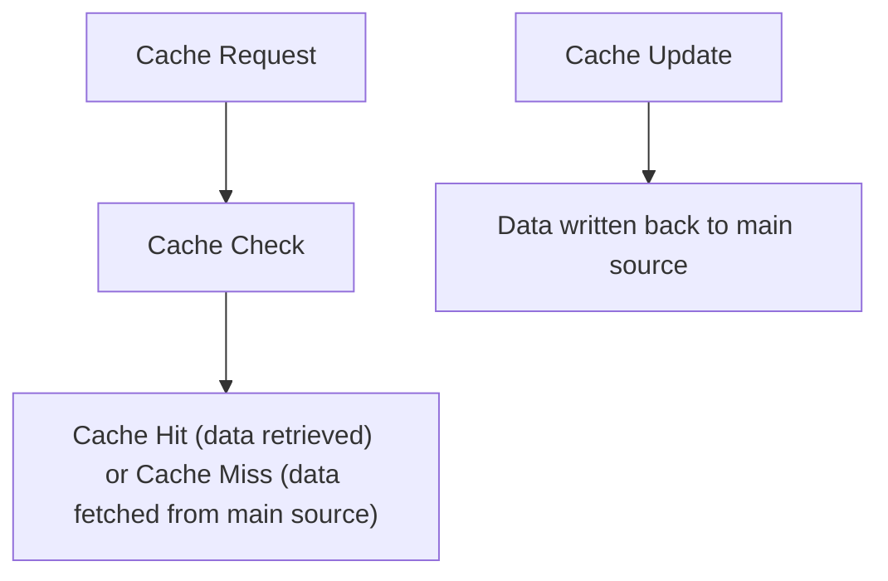

## Mental Model

Imagine you have a favorite toy box where you keep your most frequently played with toys. Every time you want to play with a toy, instead of going all the way to the storage room, you can just check your toy box first. If the toy is already there, you can play with it right away; if not, you go get it from the storage room and then put it in your toy box for next time. This is similar to how **caching** works, where frequently used information is stored in a quick-access location, like a toy box, for fast retrieval. The toy box and the storage room represent two structural components: the cache and the main memory.

## How It Works

**Caching** is a way to store information in a place where it can be accessed quickly. It exists because computers can work faster when they don't have to look for information in slow or faraway places. Here's how it works: when you need some information, your computer first checks the cache; if the information is there, it uses it right away; if not, it retrieves the information from the main memory or another source, and then it often stores a copy in the cache for future use. This helps make your computer work more efficiently by reducing the time it takes to find the information it needs.

## Key Details

**Caching** refers to the process of storing frequently accessed data in a faster, more accessible location, reducing the need for repeated requests to a slower data source. This technique is based on the principle of locality of reference, which states that data access patterns exhibit temporal and spatial locality. The primary goal of **caching** is to improve system [[Performance]] by minimizing latency and increasing throughput. Caching can be applied at various levels, including hardware, software, and network systems.



**Cache Invalidation**: When the original data changes, the cached copy may become outdated, leading to stale data being served, **Cache Size Limitations**: If the cache is too small, it may not be able to hold all the frequently accessed data, reducing its effectiveness, and **Cache Thrashing**: When the cache is constantly filled and emptied, [[Performance]] may degrade due to the overhead of cache management.

---

## The Proving Grounds

```interactive-quiz
[
  {
    "type": "mcq",
    "question": "In system design, which statement best captures the role of Caching?",
    "options": {
      "A": "Caching is the focused role or mechanism being studied inside system design.",
      "B": "Caching is only a vocabulary label and has no role in examples.",
      "C": "Caching is unrelated to the surrounding process in system design.",
      "D": "Caching can be understood without identifying any input, mechanism, or result."
    },
    "answer": "A",
    "explanation": "The useful test is whether you can connect Caching to an input, mechanism, and output inside system design."
  },
  {
    "type": "true_false",
    "question": "A useful explanation of Caching should identify what starts the process, what changes, and what result follows.",
    "answer": true,
    "explanation": "Those three parts make Caching usable across examples instead of isolated as a memorized term."
  },
  {
    "type": "writing",
    "question": "Explain Caching in one concrete system design example. Include the input, mechanism, and result.",
    "answer": "A complete answer names Caching, identifies the relevant input, explains the mechanism, and states the result in the larger system design process.",
    "required_keywords": [
      "caching"
    ],
    "explanation": "The example checks application; the non-example checks the boundary of Caching."
  }
]
```