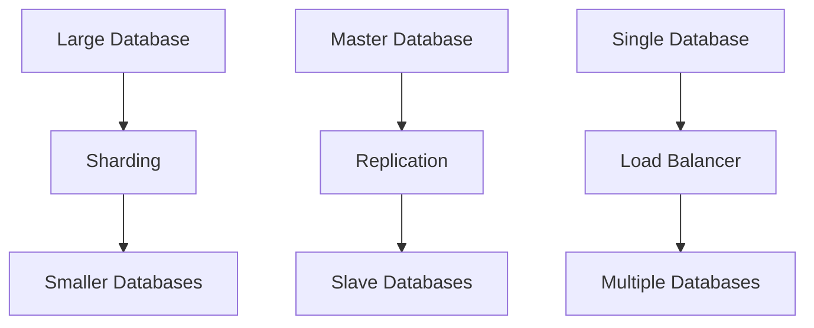

## Mental Model

Imagine a library where books are stored on shelves. As the library grows, the shelves get crowded, and it's hard to find books quickly. **Database scaling** is like adding more shelves or even more libraries to store more books, so information can be retrieved quickly and efficiently. Just as librarians organize books on shelves, **database scaling** helps organize and distribute data across multiple storage systems.

## How It Works

**Database scaling** is the process of adjusting a database's architecture to handle increased data volume, user traffic, or both. It exists because as a system grows, a single database server might become overwhelmed, slowing down or even crashing. To operate, **database scaling** involves adding more servers, distributing data across them, and ensuring that queries can be efficiently routed to the right server. This way, the system can handle more requests and larger amounts of data without [[Performance]] issues.

## Key Details

**Database scaling** refers to the process of increasing the capacity of a database to handle growing amounts of data, traffic, or workload. This is achieved through a combination of hardware and software upgrades, data distribution, and query optimization. A scalable database design enables the system to handle increased loads without compromising [[Performance]], [[Availability]], or data consistency. The goal of **database scaling** is to ensure that the database can efficiently support the growing needs of the application or system.



**Inconsistent Data**: In a distributed database, ensuring data consistency across multiple nodes can be challenging, particularly in a high-traffic environment, **Increased Complexity**: Scaling a database often introduces additional complexity, requiring more sophisticated management and monitoring tools, and **Cost Escalation**: As the database scales, the costs associated with hardware, software, and personnel can quickly escalate, potentially impacting the overall cost-effectiveness of the solution.

---

## The Proving Grounds

```interactive-quiz
[
  {
    "type": "mcq",
    "question": "In system design, which statement best captures the role of Database Scaling?",
    "options": {
      "A": "Database Scaling is the focused role or mechanism being studied inside system design.",
      "B": "Database Scaling is only a vocabulary label and has no role in examples.",
      "C": "Database Scaling is unrelated to the surrounding process in system design.",
      "D": "Database Scaling can be understood without identifying any input, mechanism, or result."
    },
    "answer": "A",
    "explanation": "The useful test is whether you can connect Database Scaling to an input, mechanism, and output inside system design."
  },
  {
    "type": "true_false",
    "question": "A useful explanation of Database Scaling should identify what starts the process, what changes, and what result follows.",
    "answer": true,
    "explanation": "Those three parts make Database Scaling usable across examples instead of isolated as a memorized term."
  },
  {
    "type": "writing",
    "question": "Explain Database Scaling in one concrete system design example. Include the input, mechanism, and result.",
    "answer": "A complete answer names Database Scaling, identifies the relevant input, explains the mechanism, and states the result in the larger system design process.",
    "required_keywords": [
      "database",
      "scaling"
    ],
    "explanation": "The example checks application; the non-example checks the boundary of Database Scaling."
  }
]
```