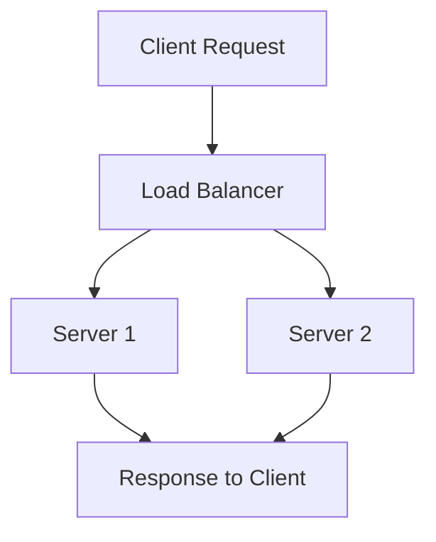

## Mental Model

Imagine you're at a big office building with many employees, and there's only one printer for everyone to use. If too many people try to print at the same time, the printer gets overwhelmed. **Load balancing** is like having a special helper that directs the print jobs to other printers in the building, so no single printer gets too busy. This way, everyone can print their documents quickly and easily.

## How It Works

**Load balancing** is a way to distribute work across many systems, like computers or servers, so that no single system gets too overwhelmed. It helps make This way, the work keeps getting done smoothly and reliably.

## Key Details

**Load balancing** is a concept in computer science that refers to the distribution of workload across multiple computing resources, such as servers, to improve responsiveness, reliability, and [[Scalability]]. It involves allocating incoming network traffic or tasks across multiple servers to enLoad balancing can be implemented using various algorithms, such as round-robin, least connection, and IP hashing.



**Single Point of Failure**: If the load balancer fails, the entire system may become unavailable, **Inefficient Resource Utilization**: Poorly configured **load balancing** algorithms can lead to underutilization or overutilization of server resources, and **Scalability Limitations**: Load balancing may not be able to handle a sudden and significant increase in traffic or workload, leading to [[Performance]] degradation.

---

## The Proving Grounds

```interactive-quiz
[
  {
    "type": "mcq",
    "question": "In system design, which statement best captures the role of Load Balancing?",
    "options": {
      "A": "Load Balancing is the focused role or mechanism being studied inside system design.",
      "B": "Load Balancing is only a vocabulary label and has no role in examples.",
      "C": "Load Balancing is unrelated to the surrounding process in system design.",
      "D": "Load Balancing can be understood without identifying any input, mechanism, or result."
    },
    "answer": "A",
    "explanation": "The useful test is whether you can connect Load Balancing to an input, mechanism, and output inside system design."
  },
  {
    "type": "true_false",
    "question": "A useful explanation of Load Balancing should identify what starts the process, what changes, and what result follows.",
    "answer": true,
    "explanation": "Those three parts make Load Balancing usable across examples instead of isolated as a memorized term."
  },
  {
    "type": "writing",
    "question": "Explain Load Balancing in one concrete system design example. Include the input, mechanism, and result.",
    "answer": "A complete answer names Load Balancing, identifies the relevant input, explains the mechanism, and states the result in the larger system design process.",
    "required_keywords": [
      "load",
      "balancing"
    ],
    "explanation": "The example checks application; the non-example checks the boundary of Load Balancing."
  }
]
```