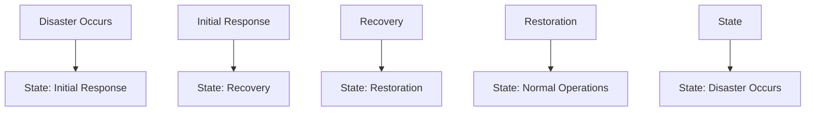

## Mental Model

Imagine a big library with millions of books. A **disaster recovery** plan is like having a backup library in a different location, so if a fire or flood destroys the main library, the backup library can provide copies of all the books. This backup library is like a mirrored copy of the main library, with all the same books and information.

## How It Works

**Disaster recovery** is a way to make sure a system keeps working even if something bad happens, like a power outage, flood, or cyber attack. It involves making a plan to quickly restore the system and its data from backups, so that people can keep using it with minimal interruption. This plan includes regularly backing up data to a separate location, having a team ready to respond to disasters, and testing the plan to make sure it works. By having a **disaster recovery** plan, a system can be designed to be more available and resilient, which is important for keeping users happy and minimizing losses.

## Key Details

**Disaster recovery** is a critical aspect of system design that focuses on ensuring the continuity of business operations in the event of a disaster or major disruption. It involves a set of policies, tools, and procedures designed to recover and restore IT infrastructure and systems within a specified time frame. The primary goal of **disaster recovery** is to minimize downtime, data loss, and the overall impact on business operations. A well-designed disaster recovery plan is essential for maintaining high [[Availability]] and reliability in system design. It requires careful planning, testing, and maintenance to ensure that systems can be quickly restored in the event of a disaster.



**Inadequate Planning**: A poorly designed or incomplete **disaster recovery** plan can lead to significant downtime and data loss, **Insufficient Resources**: Lack of sufficient resources, including personnel, equipment, and budget, can hinder the effectiveness of a disaster recovery plan, and **Untested Procedures**: Untested disaster recovery procedures can lead to confusion, delays, and failures during an actual disaster recovery effort.

---

## The Proving Grounds

```interactive-quiz
[
  {
    "type": "mcq",
    "question": "In system design, which statement best captures the role of Disaster Recovery?",
    "options": {
      "A": "Disaster Recovery is the focused role or mechanism being studied inside system design.",
      "B": "Disaster Recovery is only a vocabulary label and has no role in examples.",
      "C": "Disaster Recovery is unrelated to the surrounding process in system design.",
      "D": "Disaster Recovery can be understood without identifying any input, mechanism, or result."
    },
    "answer": "A",
    "explanation": "The useful test is whether you can connect Disaster Recovery to an input, mechanism, and output inside system design."
  },
  {
    "type": "true_false",
    "question": "A useful explanation of Disaster Recovery should identify what starts the process, what changes, and what result follows.",
    "answer": true,
    "explanation": "Those three parts make Disaster Recovery usable across examples instead of isolated as a memorized term."
  },
  {
    "type": "writing",
    "question": "Explain Disaster Recovery in one concrete system design example. Include the input, mechanism, and result.",
    "answer": "A complete answer names Disaster Recovery, identifies the relevant input, explains the mechanism, and states the result in the larger system design process.",
    "required_keywords": [
      "disaster",
      "recovery"
    ],
    "explanation": "The example checks application; the non-example checks the boundary of Disaster Recovery."
  }
]
```