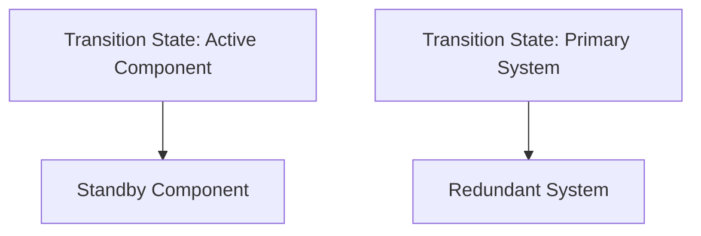

## Mental Model

Imagine you have a critical water supply system in a city, where water flows through a network of pipes to reach homes and businesses. To ensure a steady supply, the system designers build duplicate pipes that run parallel to the main pipes, so if one pipe bursts or gets blocked, the duplicate pipe can take over and continue supplying water. This is similar to **redundancy** in system design, where duplicate components or systems are built to take over in case of a failure.

## How It Works

**Redundancy** is a system design technique used to ensure [[Availability]] and reliability by having multiple copies of critical components or systems. This way, if one component fails, the duplicate can take over and prevent the entire system from failing. **Redundancy** exists to minimize downtime and ensure continuous operation, even in the face of hardware or software failures. It operates by duplicating critical components, such as servers, power supplies, or network connections, and using mechanisms like [[Load_Balancing]] or failover to switch to the duplicate component when a failure occurs.

## Key Details

**Redundancy** in system design refers to the strategic duplication of critical components or functions to ensure continued operation in the event of a failure. This concept is fundamental to achieving high [[Availability]] and reliability in systems. By incorporating **redundancy**, a system can automatically or manually switch to a redundant component or function, thereby minimizing downtime and maintaining overall system [[Performance]]. The primary goal of redundancy is to enhance fault tolerance, which is the system's ability to continue operating correctly even when one or more components fail.



**Single Point of Failure in Redundant Systems**: If not designed properly, a single point of failure can exist in redundant systems, where the failure of a critical component can still bring down the entire system, **Increased Complexity and Cost**: Implementing **redundancy** can increase the complexity of a system, which can lead to higher costs for design, implementation, and maintenance, and **False Positives and Cascading Failures**: In some cases, redundancy can lead to false positives, where a failed component is incorrectly identified as functioning, or cascading failures, where the failure of one component triggers the failure of redundant components.

---

## The Proving Grounds

```interactive-quiz
[
  {
    "type": "mcq",
    "question": "In system design, which statement best captures the role of Redundancy?",
    "options": {
      "A": "Redundancy is the focused role or mechanism being studied inside system design.",
      "B": "Redundancy is only a vocabulary label and has no role in examples.",
      "C": "Redundancy is unrelated to the surrounding process in system design.",
      "D": "Redundancy can be understood without identifying any input, mechanism, or result."
    },
    "answer": "A",
    "explanation": "The useful test is whether you can connect Redundancy to an input, mechanism, and output inside system design."
  },
  {
    "type": "true_false",
    "question": "A useful explanation of Redundancy should identify what starts the process, what changes, and what result follows.",
    "answer": true,
    "explanation": "Those three parts make Redundancy usable across examples instead of isolated as a memorized term."
  },
  {
    "type": "writing",
    "question": "Explain Redundancy in one concrete system design example. Include the input, mechanism, and result.",
    "answer": "A complete answer names Redundancy, identifies the relevant input, explains the mechanism, and states the result in the larger system design process.",
    "required_keywords": [
      "redundancy"
    ],
    "explanation": "The example checks application; the non-example checks the boundary of Redundancy."
  }
]
```