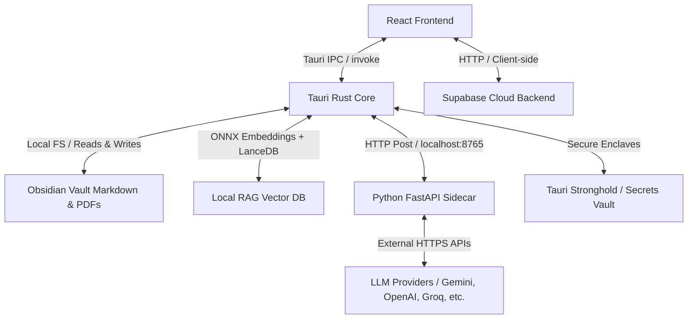
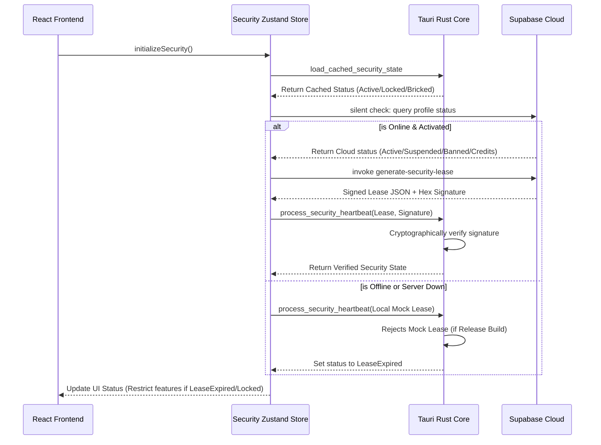

# Ater Desktop App - Master Application Interaction Map & Release Audit Checklist

This document serves as the primary verification checklist and system topology map for the production-release audit of the **Ater Desktop Application**. It maps the behavioral surface of the application, detailing every route, page hierarchy, interactive component, backend action flow, and integration boundary.

---

## 🏗️ System Architecture & Data Flow Overview

Ater v33.0 is a hybrid local-first desktop application built on **Tauri (Rust)**, **Vite + React (Frontend)**, a local **Python FastAPI Sidecar** (for AI orchestration), and a **Supabase Cloud backend** (for DRM license governance and credits transaction).



### ⚠️ Deprecation Note: Sidecar vs. Rust Native RAG
The local semantic vector database operations, file listings, and markdown parsing have been migrated to the **Tauri Rust Core** (employing `LanceDB` and `ONNX` local embedding model engines). The **Python Sidecar** remains active solely for complex AI generation pipelines (`ater_process`, `ater_generate_plan`, `generate_practice`, etc.) which query external model providers (Gemini, OpenAI, etc.).

---

## 🗺️ Application Page Connection Flow

The diagram below maps how users navigate through Ater's routes, subject to DRM Lockout screens and configuration state guards.

```mermaid
flowchart TD
    Start([Application Launch]) --> AC{Activated & Logged In?}
    AC -- No --> Login[/login]
    AC -- Yes --> Init{Vault Configured?}
    
    Login -->|useAuth.activate| Init
    Init -- No --> Onboard[/onboarding]
    Init -- Yes --> Main[Guarded App Layout]
    
    Onboard -->|finalizeSetup| Main
    
    subgraph Main [Guarded App Layout]
        direction LR
        Obsidian[/obsidian] <--> Academic[/academic]
        Academic <--> Practice[/practice]
        Practice <--> Agents[/agents]
        Agents <--> Settings[/settings]
    end
    
    DRM{DRM Lock Triggered?} -.->|Realtime hook| Lock[LockoutScreen / System Bricked]
    Main -.-> DRM
```

---

## 📦 Page-by-Page Behavioral Maps

---

### 1. Verification & Login Page (`/login`)

The secure gateway that handles Waitlist activation, user authentication, and cryptographically binds the user's hardware signature (Machine ID Hash) to their account in Supabase.

#### Hierarchy
`Login` Page $\rightarrow$ `ThemeSwitch` component & `LoginForm` $\rightarrow$ Radix UI error containers.

#### Interactive Elements
| Element | Action | Trigger | Dependency | Expected Result |
| :--- | :--- | :--- | :--- | :--- |
| **Email** Input | user_typing | Text Input Change | Client State | Stores input email locally. |
| **Password** Input | user_typing | Text Input Change | Client State | Stores input password locally. |
| **Activation Code** Input | user_typing | Text Input Change | Client State | Auto-capitalized 8-character code storage. |
| **Activate** Button | auth_activate | Form Submit | Supabase / Rust Core | Invokes activation sequence, binds machine ID, saves configuration, redirects to onboarding. |

#### Action Flow
1. **User Submits Form** $\rightarrow$ Form intercepts submit event $\rightarrow$ Runs validation checks.
2. **Retrieve Machine Signature** $\rightarrow$ Invokes Tauri `get_machine_id` $\rightarrow$ Computes SHA-256 hash of hardware footprint.
3. **Supabase Sign In** $\rightarrow$ Calls `supabase.auth.signInWithPassword` with email and password.
4. **License Checks** $\rightarrow$ Queries `profiles` table for waitlist status, approval flags, and activation code match.
5. **Machine ID Binding** $\rightarrow$ If `profile.machine_id` is empty, updates profile to bind the local machine ID hash. If mismatch, throws hardware lock error.
6. **Save Config** $\rightarrow$ Calls `saveConfig()` to write `isActivated: true`, email, code, and display name to the app config store.
7. **Redirect** $\rightarrow$ Navigates to `/onboarding`.

#### 🔴 Fragile Points (Critical Validation)
* **Tauri Rust Core**: Calls native `get_machine_id` which accesses OS hardware APIs.
* **External Network**: Communicates directly with Supabase Auth endpoints and database tables.
* **Security & DRM**: Validates waitlist credentials; rejects login if account is flagged as banned or suspended.

---

### 2. System Onboarding Wizard (`/onboarding`)

A 6-step interactive scaffolding wizard designed to link the local file system (Obsidian Vault), configure AI providers, establish Focus Timer variables, and deploy academic program folders into the vault.

#### Hierarchy
`Onboarding` Page $\rightarrow$ Multi-step wizard cards $\rightarrow$ Forms & `Radix Dialog` Modals.
* Step 1: User Profile
* Step 2: Vault Selection
* Step 3: AI Provider Key Vault
* Step 4: Pomodoro Settings
* Step 5: Academic Program Preset Scaffolding
* Step 6: Finalize Scaffolding

#### Interactive Elements
| Element | Action | Trigger | Dependency | Expected Result |
| :--- | :--- | :--- | :--- | :--- |
| **Name** Input | profile_name | Input typing | Client state | Captures student display name. |
| **Choose Folder** Button | select_vault_folder | Button Click | Tauri Dialog Plugin | Opens native OS folder selector; returns absolute vault path. |
| **Accept Detected Config** | fast_track_onboarding | Button Click | Local FS / Rust Core | Wires database from existing vault `user_profile.md` properties. |
| **Add Key** Input / Button | add_api_key | Click / Inputs | Client State | Appends API key payload to the local credentials array. |
| **Test Connection** Button | test_ai_connection | Button Click | Sidecar API / Rust Core | Invokes LLM testing routine; returns auth status. |
| **Delete Key** Button | delete_api_key | Button Click | Config Context | Removes credential from configuration state. |
| **Program Presets** Select | apply_preset | Select Change | Program Preset Map | Pre-populates courses, semesters, difficulty mapping state. |
| **Scaffold / Continue** | finalize_setup | Button Click | Local FS / Rust Core | Creates directories, creates markdown files, initializes SQLite, redirects to Obsidian workspace. |

#### Action Flow
1. **Directory Validation (Vault Selection)** $\rightarrow$ Dialog returns path $\rightarrow$ Saves path to config $\rightarrow$ Invokes `initialize_database` IPC command.
2. **Auto-Detect Configuration** $\rightarrow$ Invokes `read_obsidian_note('database/user_profile.md')` $\rightarrow$ Parses frontmatter. If found, displays *Existing Vault Detected Modal*, enabling fast-track setup bypass.
3. **Verify API Provider** $\rightarrow$ User inputs API key $\rightarrow$ Clicks *Test Connection* $\rightarrow$ Invokes `test_ai_connection` $\rightarrow$ Tauri Rust Core runs HTTP request to the designated provider (Gemini, OpenAI, etc.).
4. **Scaffolding Directories** $\rightarrow$ Finalize button triggers `initializeVault` IPC $\rightarrow$ Rust Core runs `heal_vault_structure` (generating `Inbox/`, `Notes/`, `database/`, and nested property folders).
5. **Roadmap Scaffolding** $\rightarrow$ Triggers `academicsSyncProfile` $\rightarrow$ Sequentially runs `createVaultRow` IPC calls to populate markdown templates for semesters, years, and courses.
6. **Local Profile Serialization** $\rightarrow$ Serializes onboarding configuration as frontmatter $\rightarrow$ Invokes `createObsidianFile('database/user_profile.md')` to persist.
7. **Cloud sync** $\rightarrow$ Updates Supabase profile table marking `is_configured: true`. Redirects to `/obsidian`.

#### 🔴 Fragile Points (Critical Validation)
* **Local Filesystem**: Writes folder topologies and markdown files directly to user disk. Permission blocks or Read-Only permissions on selected folders will halt the wizard.
* **Tauri Rust Core**: Direct execution of native shell dialogue plugins (`tauri_plugin_dialog`).
* **External Network**: Calls Supabase database, and makes outbound HTTP queries to AI provider endpoints.

---

### 3. Obsidian Vault Workspace (`/obsidian`)

The primary workspace layout featuring the side-by-side file navigation tree, central Monaco Editor / Markdown preview canvas, and an interactive Inspector panel.

#### Hierarchy
`ObsidianVaultPage` $\rightarrow$ Left Panel (`sidebarTab` selector $\rightarrow$ Explorer Tree / Hubs / PDF lists) $\rightarrow$ Central Workspace (`ObsidianEditor` / `MarkdownViewer` / `PdfViewer`) $\rightarrow$ Right Inspector Panel (`NoteProperties` / `HubConnectionsNav` / `AterDashboard`).

#### Interactive Elements
| Element | Action | Trigger | Dependency | Expected Result |
| :--- | :--- | :--- | :--- | :--- |
| **File Tree Item** | select_obsidian_file | Click | Rust Core IPC | Invokes `read_obsidian_note`, parses frontmatter, populates editor. |
| **New File / Folder** Icon | create_item | Click | Rust Core IPC | Invokes `create_obsidian_file` or `create_obsidian_folder` in selected path. |
| **Rename File / Folder** | rename_item | Double-Click / Input | Rust Core IPC | Invokes `rename_vault_file` or `move_obsidian_item` to update disk paths. |
| **Delete File / Folder** | delete_item | Click | Rust Core IPC | Invokes `delete_obsidian_item` to permanently remove item from disk. |
| **Draggable Nodes** | drag_drop_node | Drag & Drop | Rust Core IPC | Invokes `move_obsidian_item` to restructure folders on disk. |
| **Monaco Textarea** | text_edit | Input Keyboard | Monaco Editor | Updates React state cache. |
| **Save Note** Button | save_note | Button Click | Rust Core IPC | Invokes `update_obsidian_note` to overwrite file on disk; clears cache. |
| **Jump to Source PDF** | open_source_pdf | Button Click | Rust Core IPC | Searches pages frontmatter $\rightarrow$ opens PDF viewer at target waypoint. |
| **YAML Property Input** | update_property | Input Edit / Checkbox | Markdown Helpers | Calls `updateProperty()` $\rightarrow$ invokes `update_obsidian_note` IPC to write frontmatter. |
| **Concept Checklist** | toggle_read | Checkbox Toggle | Markdown Helpers | Sets `read: true/false` in frontmatter; checks/unchecks task in parent hub note. |
| **SRS Review Rating** (1-5) | rate_srs | Button Click | Rust Core IPC | Invokes `srs_review` to record Leitner system scheduling telemetry. |
| **AI Watcher** Toggle | toggle_auto_deploy | Toggle Click | Rust Core / Sidecar | Invokes `ater_watcher_toggle` to trigger folder scanning services. |
| **AI Plan Generate** | generate_ingest_plan | Button Click | Sidecar API / LLM | Invokes `ater_generate_plan`; sidecar reads PDF, structures curriculum. |
| **Confirm Ingestion Batch** | confirm_batch | Button Click | Sidecar API / LLM | Invokes `ater_confirm`; sidecar writes batch notes to vault disk. |

#### Action Flow
* **File Selection**: Click node $\rightarrow$ Sets `selectedPath` $\rightarrow$ Calls `read_obsidian_note` $\rightarrow$ Rust backend reads the markdown file, parses YAML into a JSON object, and strips body text $\rightarrow$ Populates Monaco Editor state.
* **Saving Note Modifications**: Click *Save* $\rightarrow$ Formats frontmatter and markdown body $\rightarrow$ Invokes `update_obsidian_note` $\rightarrow$ Rust writes content to local disk $\rightarrow$ Triggers local vector DB re-indexing.
* **Topic Checklist Synchronization**: Check list item $\rightarrow$ Parses `noteContent` $\rightarrow$ Surgical regex replacement of task token `[ ]` with `[x]` $\rightarrow$ Calls `update_obsidian_note` to save $\rightarrow$ Identifies parent hub note $\rightarrow$ Recursively reads and updates parent checkbox state.
* **Ater AI Ingestion Pipeline**: Ingest PDF $\rightarrow$ Select PDF file in Inbox $\rightarrow$ Click *Process* $\rightarrow$ Calls `ater_generate_plan` sidecar API $\rightarrow$ Python sidecar extracts text, parses hierarchy, maps dependency loops via LLM, and returns structured plan $\rightarrow$ Frontend displays plan layout $\rightarrow$ User clicks *Confirm* $\rightarrow$ Calls `ater_confirm` $\rightarrow$ Sidecar processes notes batch-by-batch (writing files to disk) while updating Zustand progress status.

#### 🔴 Fragile Points (Critical Validation)
* **Local Filesystem**: High-frequency disk reads/writes. Folder renaming or locking while editor is open can cause file corruption or save failures.
* **Tauri Rust Core**: Direct execution of native shell file operation bindings (create, delete, write, rename).
* **Python Sidecar**: Coordinates PDF text extraction, ONNX embeddings generation, and LanceDB storage.
* **External Network**: Calls LLM APIs via sidecar proxy during generation, schema creation, and Feynman review checks.

---

### 4. Academic Dashboard (`/academic`)

The administrative and planning center. Maps the Obsidian databases (markdown files under `database/`) to structured tables, schedules, and progress lists.

#### Hierarchy
`AcademicDashboard` Page $\rightarrow$ Tabs Selector $\rightarrow$ Nested Tab Panels:
* `PROGRAM` Tab $\rightarrow$ Academic Level and Curriculum years roadmap list.
* `COURSES` Tab $\rightarrow$ Registered courses list $\rightarrow$ Relation editor.
* `PLANNER` Tab $\rightarrow$ Calendar scheduler & Pomodoro statistics dashboard.
* `ASSIGNMENTS` Tab $\rightarrow$ Upcoming assignments checklist.
* `EXAMS` Tab $\rightarrow$ Exams list, grading scales, and study sessions.
* `PRACTICE` Tab $\rightarrow$ Recall module wrapper.
* `CALENDAR` Radix Dialog Modal.

#### Interactive Elements
| Element | Action | Trigger | Dependency | Expected Result |
| :--- | :--- | :--- | :--- | :--- |
| **Sync Database** Icon | refresh_databases | Button Click | Rust Core IPC | Invokes `academics_sync_profile` to reload and rebuild memory cache. |
| **Add Row** Button | create_db_row | Button Click | Rust Core IPC | Invokes `create_vault_row` to write new database markdown item to disk. |
| **Delete Row** Icon | delete_db_row | Button Click | Rust Core IPC | Invokes `delete_vault_row` to delete database markdown item from disk. |
| **Edit Cells** Inputs | update_db_row | Input Edit / Change | Rust Core IPC | Invokes `update_vault_row` / `rename_vault_file` to write frontmatter updates. |
| **Link to Hub** | open_hub_note | Button Click | Router navigate | Navigates to `/obsidian?path=...` in focus mode. |
| **Academic Calendar** | toggle_calendar | Button Click | Router search | Toggles calendar display view. |

#### Action Flow
1. **Syncing State**: Clicking *Sync* $\rightarrow$ Invokes `academics_sync_profile` IPC $\rightarrow$ Rust core traverses all directory folders under `database/` $\rightarrow$ Re-indexes frontmatter properties $\rightarrow$ Reconciles local memory cache $\rightarrow$ Renders updated table.
2. **Row Creation**: Click *Add Assignment* $\rightarrow$ Prompt for title $\rightarrow$ Invokes `create_vault_row` IPC $\rightarrow$ Rust core creates a file `database/assignments/New_Assignment.md` populated with empty default database properties $\rightarrow$ Triggers React state reload.
3. **Relation Upgrades**: Modify course relation inside assignment editor $\rightarrow$ Invokes `update_vault_row` IPC $\rightarrow$ Rust Core rewrites the frontmatter key `Course: "[[CS_201]]"` $\rightarrow$ Triggers re-indexing.

#### 🔴 Fragile Points (Critical Validation)
* **Local Filesystem**: Reads and writes structural templates and user-created folders under the vault directory.
* **Tauri Rust Core**: Direct execution of native shell directory listings, file checks, and file writes.

---

### 5. Active Recall Practice Module (`/practice`)

The testing sandbox. Generates customized quizzes from vault notes, supports interactive sessions, and tracks telemetry analytics.

#### Hierarchy
`PracticeModule` Page $\rightarrow$ Tab switcher $\rightarrow$ Sub-views:
* `dashboard`: modality statistics, trend charts (Recharts), weakest concepts.
* `history`: historical quiz attempts lists.
* `configuring`: custom session settings, notes selector, presets, question distribution sliders.
* `vault` (Reference Vault): raw file uploaders, questions banks.
* `session`: quiz runner container.
* `results`: score breakdowns and feedback dashboards.

#### Interactive Elements
| Element | Action | Trigger | Dependency | Expected Result |
| :--- | :--- | :--- | :--- | :--- |
| **Start Custom Session** | configure_practice | Button Click | Router search | Redirects to configuration view. |
| **Apply Preset** Button | select_preset | Button Click | Presets Config | Populates question distribution sliders. |
| **Review Due** Button | run_srs_due | Button Click | Rust Core / Sidecar | Invokes `srs_due` IPC $\rightarrow$ generates practice from overdue cards. |
| **Upload PDF/Text** | upload_source | Click / Drag-Drop | Sidecar API / LLM | Invokes `vault_upload_text` / `vault_upload_file` to parse questions. |
| **Submit Answer** Button | check_answer | Button Click | Session Hook | Evaluates local answers; triggers LLM evaluation for Feynman/writing items. |
| **Next Question** Button | advance_question | Button Click | Session Hook | Advances quiz state; saves progress upon session completion. |
| **Explain Question** | explain_concept | Button Click | Sidecar / LLM | Invokes `explain_question` to stream LLM explanations. |

#### Action Flow
1. **Initiate Quiz Generation** $\rightarrow$ User selects notes and selects question distribution $\rightarrow$ Clicks *Start* $\rightarrow$ Invokes `generate_practice` $\rightarrow$ Rust Core reads note content $\rightarrow$ Passes payload to Python sidecar $\rightarrow$ Sidecar formats LLM system prompts and calls LLM $\rightarrow$ Returns structured question JSON $\rightarrow$ Writes session history file to `database/practices/` folder.
2. **Reviewing Answers** $\rightarrow$ User types answer $\rightarrow$ Clicks *Submit* $\rightarrow$ Local evaluations grade MCQs/Matching $\rightarrow$ If Writing/Feynman model, passes answer to sidecar `srs_feynman_validate` $\rightarrow$ LLM reviews and scores (0-100) based on required keywords $\rightarrow$ Renders scoring alerts.
3. **Session Finalize** $\rightarrow$ Quiz ends $\rightarrow$ Invokes `log_practice_result` and `update_practice_score` IPC commands $\rightarrow$ Updates local telemetry database $\rightarrow$ Updates Spaced Repetition (SRS) scheduling variables in note frontmatter.

#### 🔴 Fragile Points (Critical Validation)
* **Local Filesystem**: Reads Obsidian vault notes, and writes practice attempts to the `database/practices/` folder.
* **Tauri Rust Core**: Integrates filesystem calls with SQLite telemetry tracking commands.
* **Python Sidecar**: Parses PDFs, generates questions via LLM, and validates complex Feynman writing answers.
* **External Network**: Calls LLM APIs (Gemini, OpenAI) for question generation, answer reviews, and chat explanations.

---

### 6. Application Settings (`/settings`)

The dashboard console. Configures system variables, manages API keys, triggers updates, and handles troubleshooting actions.

#### Hierarchy
`Settings` Page $\rightarrow$ Radix Tabs Selector $\rightarrow$ Cards: App Settings, AI Provider, Diagnostics & Recovery.

#### Interactive Elements
| Element | Action | Trigger | Dependency | Expected Result |
| :--- | :--- | :--- | :--- | :--- |
| **General Folder Select** | set_folder_paths | Button Click | Tauri Dialog | Opens native dialog; updates config state. |
| **Auto-Scan Toggle** | toggle_auto_scan | Button Click | Rust Core IPC | Invokes `ater_watcher_toggle` to enable/disable directory watcher. |
| **Check for Updates** | check_updates | Button Click | Tauri Updater / Rust | Calls Tauri updater plug-in; invokes `check_remote_version` on fail. |
| **Save Settings** Button | save_settings | Button Click | Config Context | Writes configuration files; restarts watcher. |
| **Export Logs** Button | export_logs | Button Click | Rust Core IPC | Invokes `export_logs` $\rightarrow$ compresses files to ZIP; copies path. |
| **Danger Zone Buttons** | trigger_resets | Button Click | Rust Core IPC | Triggers Radix dialog alerts (Reset, Clear, Factory Reset). |

#### Action Flow
* **Directory Watcher Sync**: Toggle Auto-Scan $\rightarrow$ Saves config `autoDeploy: true` $\rightarrow$ Invokes `ater_watcher_toggle` IPC $\rightarrow$ Rust core starts a background thread file watcher monitoring changes in `obsidianVaultPath` and `inboxPath`.
* **Exporting Troubleshooting Logs**: Click *Save Logs* $\rightarrow$ Invokes `export_logs` IPC $\rightarrow$ Rust core resolves `~/.ater/logs/` path $\rightarrow$ Spawns native shell command (`zip` or `Compress-Archive`) $\rightarrow$ Writes ZIP package to temp directory $\rightarrow$ Copies path to clipboard.
* **Executing Factory Reset**: Click *Factory Reset* $\rightarrow$ Radical Alert confirmation $\rightarrow$ Invokes `factory_reset` IPC $\rightarrow$ Rust core wipes `~/.ater/` directory, deletes vector DB stores, and resets configurations $\rightarrow$ Spawns native process relaunch command $\rightarrow$ Application restarts.

#### 🔴 Fragile Points (Critical Validation)
* **Local Filesystem**: Overwrites config files, deletes files, and writes ZIP archives.
* **Tauri Rust Core**: Accesses native updater plugins, spawns child shell scripts (ZIP commands), and restarts processes.
* **External Network**: Calls GitHub Releases to check version manifests, and logs out of Supabase.

---

## 🔒 Security, DRM, & Access Controls (The Guards)

Ater implements a zero-trust offline lease DRM architecture. The system checks license clearances at startup, dynamically locks routes, and handles billing transactions.



### Feature Lock Definitions
* **`full-system-lockout` (Bricked)**: Triggered when device footprint is blacklisted or user status is revoked. Disables keyboard listeners and overlays the `LockoutScreen`.
* **`file_ingestion` / `explorer-lockout`**: Restricts the File Explorer and Markdown editor to read-only.
* **`ai-features` / `ai_locked`**: Disables AI chat and note generations.
* **`interactive_quiz` / `academic_locked`**: Restricts creating or editing academic task rows.

---

## 🏁 Production-Release Verification Checklist

Use the table below during the release audit to confirm the integrity of Ater's local and cloud integration points.

| Audit Area | Verification Target | Test Strategy | Pass Criteria |
| :--- | :--- | :--- | :--- |
| **Filesystem Access** | Local read/write permissions | Select folder, run onboarding scaffolding, edit notes. | Directories successfully scaffolded; markdown files created; no permissions errors. |
| **Tauri Rust Core** | IPC commands registration | Verify all invoke calls return correctly. | No `Unknown Command` Rust panics on launch or during navigation. |
| **Python Sidecar** | Process spawning & API proxy | Launch app; upload PDF; generate a plan. | Process successfully spawns; stdout is drained; API responds to health check within 30s. |
| **OS-level Assets** | Binaries and ONNX models packaging | Verify binaries directory structure. | `ater-api` binary, `model.onnx`, and `tokenizer.json` exist in application directories. |
| **External Network** | Supabase connection & DRM verification | Perform online activation; toggle internet connection; verify feature locks. | Silently authenticates; applies signed lease; gracefully downgrades to read-only mode offline. |
| **External Network** | AI Provider API calls | Configure Gemini / OpenAI key; test connection. | Response code `200 OK` received; rate limits recorded; credit balances deducted correctly. |
| **Diagnostics & Recovery** | Logs export & Factory reset | Export logs; trigger factory reset. | ZIP log created; app wipes files and successfully restarts. |
