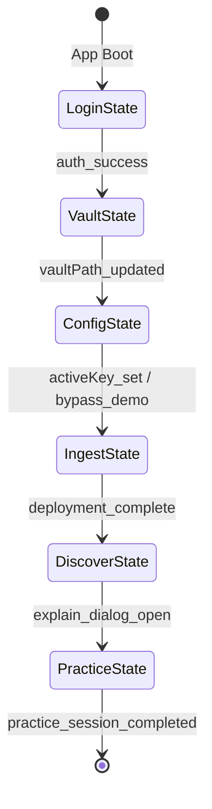

# Ater Interactive Walkthrough Logic Specification

This specification replaces the old linear, button-clicking 160-step walkthrough with a **Trigger-Based Advancement System**. Instead of arbitrary 'Next' buttons, the interactive walkthrough hooks directly into application state silos (Tauri app store, React auth contexts, Zustand telemetry stores) to advance *only* when the user completes the target action.

---

## The Walkthrough State Machine

The walkthrough behaves as a sequential state machine tracking the user through the **Golden Path**:

---

## Step-by-Step Flow Specification

### Milestone 1: Activation & Login
* **Route Context:** `/login`
* **Target Element:** `form button[type="submit"]` (Labeled: `ACTIVATE`)
* **Instruction Text:** 
  > "Enter your account email, password, and the Activation Code from your waitlist approval email, then click **Activate** to authenticate your desktop application."
* **Success Trigger:** `auth_success`
  - *Verification State:* Triggers when `useAuth().activate` finishes successfully, setting the token store and changing client auth status to `'authenticated'`.
* **Failure Fallback:**
  - If a validation error is returned (e.g. invalid code), highlight the validation banner component `.p-4.border-destructive` with a tooltip indicating: *"Double-check your approval code or email address. Ensure there are no spaces."*

---

### Milestone 2: Workspace Vault Location
* **Route Context:** `/onboarding` (Step 2)
* **Target Element:** `button:has-text("Choose Folder")` / `[data-tour="select-vault-btn"]`
* **Instruction Text:** 
  > "Click **Choose Folder** to select a folder on your device. This folder will be your Obsidian notes workspace. All files stay local to your machine."
* **Success Trigger:** `vaultPath_updated`
  - *Verification State:* Fires when `@tauri-apps/plugin-dialog` returns a valid directory path, prompting Ater to write a probe file (`database/.write_test`) to verify write permissions, and updates `config.obsidianVaultPath` in the app store.
* **Failure Fallback:**
  - If Ater throws a permission error (e.g., read-only system folder), highlight the directory selection box with the message: *"Ater cannot write to that directory. Please choose a folder under your user home directory (e.g., Documents/Notes)."*

---

### Milestone 3: AI Reasoning Config
* **Route Context:** `/onboarding` (Step 3) or `/settings`
* **Target Element:** `button:has-text("Save Key")` / `[data-tour="save-key-btn"]`
* **Instruction Text:** 
  > "Add your LLM provider details, enter your API key, and click **Save Key** to activate Ater's vector search and notes planning models."
* **Success Trigger:** `activeKey_set`
  - *Verification State:* Advanced when `config.aiApiKey` is populated, and `sidecarApi.testAiConnection` returns `success: true`.
* **Bypass Trigger (Demo Mode):**
  - If the user selects the check box `Start with Guided Walkthrough Tour` on Step 6, the state machine transitions to `bypass_demo`, setting `config.isDemoMode = true` and loading local mock data.
* **Failure Fallback:**
  - If the connection test fails, show a tooltip pointing to the connection status panel: *"Connection failed. Verify your key value is correct or check your network proxy settings. You can also skip this step to run in offline Demo Mode."*

---

### Milestone 4: Knowledge Ingestion
* **Route Context:** `/agents?tab=pipeline`
* **Target Element Flow:** 
  1. `[data-tour="inbox-file-item"]` (Inbox PDF list item)
  2. `button:has-text("Process File")`
  3. `button:has-text("Generate Plan")`
  4. `button:has-text("Confirm Setup & Deploy")`
* **Instruction Text:** 
  > "Select a PDF in your inbox, click **Process File** to identify its curriculum structure, click **Generate Plan** to review the proposed study files, and select **Confirm Setup & Deploy** to generate structured notes."
* **Success Trigger:** `deployment_complete`
  - *Verification State:* Advancing occurs when the telemetry store catches the transition of the process queue status from `'running'` to `'idle'` after completing all plan batches, signaling that all structured notes have been written.
* **Failure Fallback:**
  - If planning fails due to rate limits or API outages, display a tooltip pointing to the Auto-Deploy toggle in the header: *"Ingestion failed. You can toggle 'Auto-Scan Folder' in settings to copy files directly into your workspace folders to process them later."*

---

### Milestone 5: Pedagogical Discovery
* **Route Context:** `/obsidian`
* **Target Element:** `[data-tour="explain-btn"]` / `.wiki-link` (Checklists/Links)
* **Instruction Text:** 
  > "Open your generated notes. Highlight any concept in the viewer or click the **Explain** button to launch a Socratic explanation dialog."
* **Success Trigger:** `explain_dialog_open`
  - *Verification State:* Fires when `AterExplainDialog` shifts its visibility status to active (`open = true`), mounting the explanation frame.
* **Failure Fallback:**
  - If the user doesn't select text, point a tooltip to the left sidebar explorer tab (`[data-tour="sidebar-knowledge"]`): *"Click a note file in the left folder tree to load it, then select any word or click 'Explain' in the top-right toolbar."*

---

### Milestone 6: Active Learning & Practice
* **Route Context:** `/practice` (or inside `/academic` under the `PRACTICE` tab)
* **Target Element Flow:**
  1. `button:has-text("Start Practice")` (In configuring view)
  2. `button:has-text("Submit Answer")` (In session view)
* **Instruction Text:** 
  > "Configure your question types, click **Start Practice** to generate your active recall exam, and click **Submit Answer** to test your retention."
* **Success Trigger:** `practice_session_completed`
  - *Verification State:* Advancing occurs when the user submits their final answers, views the Trophy results screen, and clicks "Finish Session" to write log data via `sidecarApi.logPracticeResult`.
* **Failure Fallback:**
  - If the user wants a quick start, point to the "Review Due" action button: *"You can click 'Review Due' on the dashboard to immediately test yourself on pending spaced-repetition cards."*
