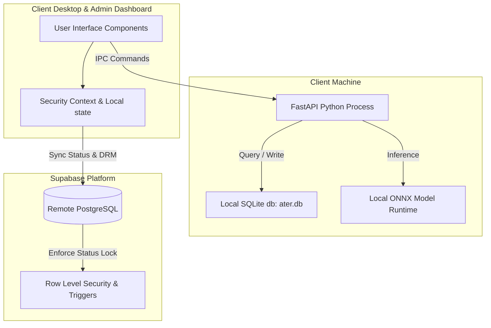
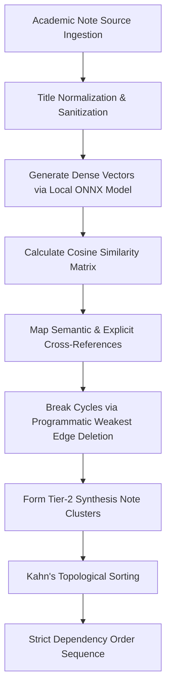

# Zero-Defect Technical Specification: DRM, Layout, and Sidecar

This document defines the zero-defect specification for Ater. It describes the state and architectural constraints governing user license verification, layout responsiveness, and the machine learning sidecar process lifecycle.

---

## 1. Architectural Boundaries

Ater relies on a strict separation of concerns between remote database verification and local-first execution.

### Constraints
- **Core Invariant**: All core cognitive functions (reading, FSRS, practice, vault operations) must execute fully offline.
- **Verification Invariant**: Remote database synchronization is restricted to authentication and profile status sync. If offline, the client uses a local cryptographically signed cache lease to allow temporary access.

---

## 2. DRM & Anti-Piracy Security Architecture

The digital rights management (DRM) system enforces hardware licensing, prevents concurrent account sharing, and locks accounts upon administrative revocation or blacklisting.

### 2.1 database Schema and RLS Policies
All administrative profile modifications are restricted by PostgreSQL Row Level Security (RLS) policies. Column updates are guarded by database triggers.

#### Profiles Table Row Level Security
Managed in [drm_rls_policies.sql](file:///Users/dabodestroyer/code/Antigravity/Ater/supabase/migrations/drm_rls_policies.sql):
- **Select Access**: Standard authenticated users can retrieve their own profiles via `auth.uid() = id`.
- **Update Access**: Standard owners can write to safe profile columns, but administrative column edits are validated by the `verify_profile_state_transitions()` trigger.
- **Admin Access**: Authenticated administrators (defined as `role = 'Admin'`) hold full CRUD permissions.

#### Hardware Blacklist RLS
Managed in [drm_lockout_system.sql](file:///Users/dabodestroyer/code/Antigravity/Ater/supabase/migrations/drm_lockout_system.sql):
- **Access Rule**: Row read and write operations are strictly restricted to authenticated administrators. Standard users cannot read blacklisted machine hashes.

### 2.2 Security Trigger Specifications
Two security triggers enforce the DRM state machine.

#### A. Zero-Trust Guard: `verify_profile_state_transitions`
Runs `BEFORE UPDATE ON public.profiles`. Validates the transition state of administrative columns.

1. **Administrative Locking**: Checks if `role`, `is_approved`, `waitlist_status`, `locked_features`, `credit_balance`, or `account_status` columns differ between the `NEW` and `OLD` row records. If a difference is found, it verifies that the client is either an authenticated database administrator (`is_admin() = true`) or the database `service_role`. Standard client connections are immediately rejected.
2. **Permanent Hardware Binding**: Once a profile's `machine_id` is written, it is locked. The trigger raises an exception if `OLD.machine_id` is not null and `NEW.machine_id` differs from it, unless authorized by `service_role` or an Admin.

#### B. Hardware Blacklist Enforcement: `check_hardware_blacklist`
Runs `BEFORE INSERT OR UPDATE OF machine_id ON public.profiles`.
1. Extracts the incoming `machine_id` value.
2. Verifies whether the raw string value or its SHA-256 hex digest matches a record inside `public.hardware_blacklist.machine_id_hash`.
3. Rejects matches with SQL error code `D0001`.

---

## 3. Responsive Layout & Theme Specification

Ater enforces a strict monochrome visual layout using Bento box components. It must render correctly on all viewport resolutions down to 1024px, with specific support for the 1280px workspace standard.

### 3.1 Styling Guidelines
- **Monochrome Theme Palette**: The color scheme is derived from HSL CSS variables configured in Tailwind. Magic hex values are prohibited.
- **Font Face**: The `Outfit` font is the exclusive typeface used in Ater. No secondary font families may be registered.
- **No Bullet Points in Prose**: Any text block generated or displayed inside the mental model and main content blocks must be continuous prose paragraphs. Bullet points are restricted to practice sections.

### 3.2 Component Tokens

| Semantic Token | Tailwind Class | Light Mode HSL | Dark Mode HSL |
|---|---|---|---|
| Panel Background | `bg-bento-panel` | `0 0% 100%` | `240 5.9% 10%` |
| Card Background | `bg-bento-card` | `240 4.8% 95.9%` | `240 3.7% 15.9%` |
| Item Background | `bg-bento-item` | `240 5.9% 90%` | `240 3.7% 12%` |
| Accent/Border | `border-border` | `240 5.9% 90%` | `240 3.7% 15.9%` |

### 3.3 Responsive Scaling Engine
To guarantee zero-overflow at 1280px:
1. **Dynamic Layout Framework**: Sidebar components hold fixed pixel widths (e.g. `w-64 shrink-0`), while content cards use fluid sizing parameters (`flex-1 min-w-0 w-full`).
2. **Horizontal Containment**: Grid components inside statistics and dashboard cards are configured using fractional units (`grid-cols-2` or `grid-cols-1 md:grid-cols-2`) and avoid fixed-width wrapper containers.
3. **Chart Viewport Responsiveness**: SVG charts must be nested inside `<ResponsiveContainer width="100%" height="100%">` elements. Sizing calculations are updated dynamically via browser `ResizeObserver` callbacks to match wrapper boundaries.

---

## 4. Python API Sidecar Specification

The ML sidecar is a local Python web service managed by the desktop client.

### 4.1 Process Lifecycle
- **Startup Invariant**: The web server must start in under 50 milliseconds. To satisfy this, all model initialization packages (`onnxruntime` and `transformers`) must be lazy-loaded. They are only loaded on the first active embedding or RAG query.
- **Memory Management**: The sidecar implements an `unload()` lifecycle hook to clear model tokens and runtime objects from the host system memory.

### 4.2 Semantic RAG Ingest Pipeline
 RAG processing is handled offline by the `EmbeddingsLinker` class:

1. **Sanitization**: Validates titles and formats notes using the 4-section model structure.
2. **Dense Vector Embeddings**: Generates 384-dimensional dense vectors using a local ONNX model runtime. Computes a cosine similarity matrix of the note vectors.
3. **Dependency Mapping**:
   - **Semantic Links**: Pairs notes with cosine similarity scores above 0.65, mapping links from earlier pages to later pages.
   - **Explicit Links**: Uses regex boundaries to find cross-references in the note body.
4. **Cycle Resolution**: Detects circular dependencies. The cycle is broken by identifying the weakest link in the loop (the reference with the lowest cosine similarity) and deleting it.
5. **Synthesis Note Clustering**: Concepts with cosine similarity scores above 0.75 are clustered. For clusters with two or more items, a Tier 2 Synthesis Note Plan is generated and appended.
6. **Topological Sort**: Sorts the planned notes in strict dependency order using Kahn's algorithm. Tie-breaks are resolved using minimum page numbers, followed by character offset in the source material.
