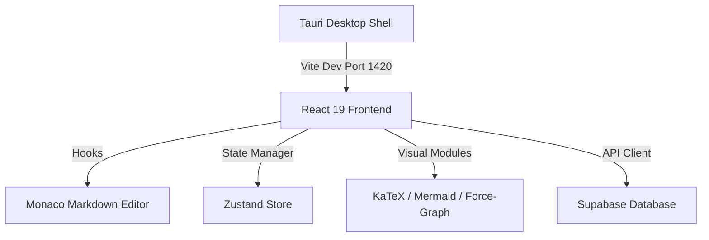

# Technical Design: Ater Desktop Architecture

> Technical specifications, component breakdown, and database schemas for the Ater scaffold.

---

## 🏗️ System Architecture



---

## 🎨 Visual System & Component Mapping

*   **Asymmetric 3-Column Grid**:
    1.  *Navigation Column*: Flat-layout folder/file trees (`docs/agents/`, `.scratch/`).
    2.  *Editor Column*: Active Monaco markdown instance with strict Gutter spacing laws.
    3.  *Inspector Column*: AST syntax validation status, KaTeX renders, and the Interactive Quiz Engine.
*   **De-warmed Slate Palette**: Tinted neutrals to maximize dark-mode contrast (`hsl(210, 15%, 8%)` background, Electric Cyan accent for active states).

---

## 🗄️ Database & Security Schema

### Note Storage Table
```sql
create table public.notes (
  id uuid default gen_random_uuid() primary key,
  title text not null,
  content text not null,
  course text not null,
  semester text not null,
  unit text not null,
  created_at timestamp with time zone default timezone('utc'::text, now()) not null
);
```

### Row Level Security (RLS)
```sql
alter table public.notes enable row level security;
create policy "Users can only read own notes" on public.notes
  for select using (auth.uid() = user_id);
```
